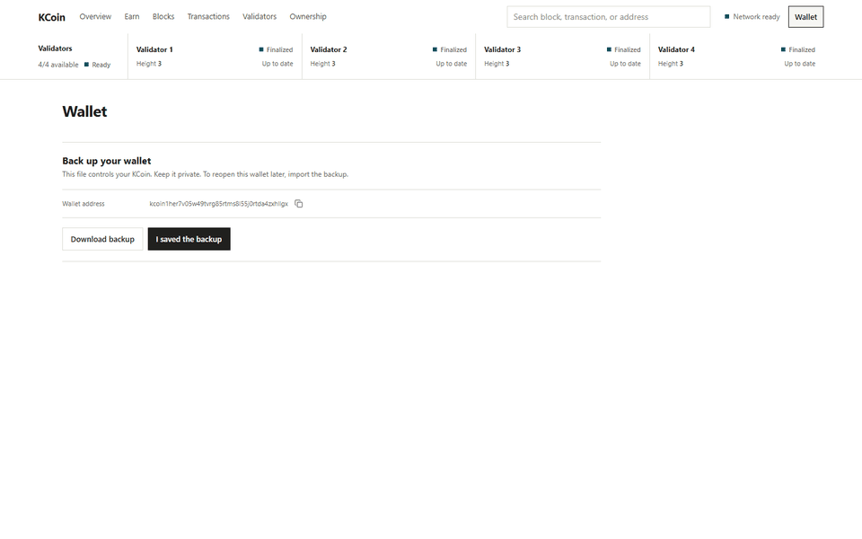
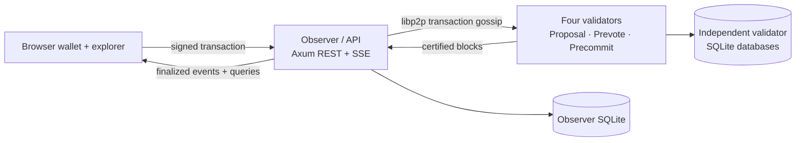
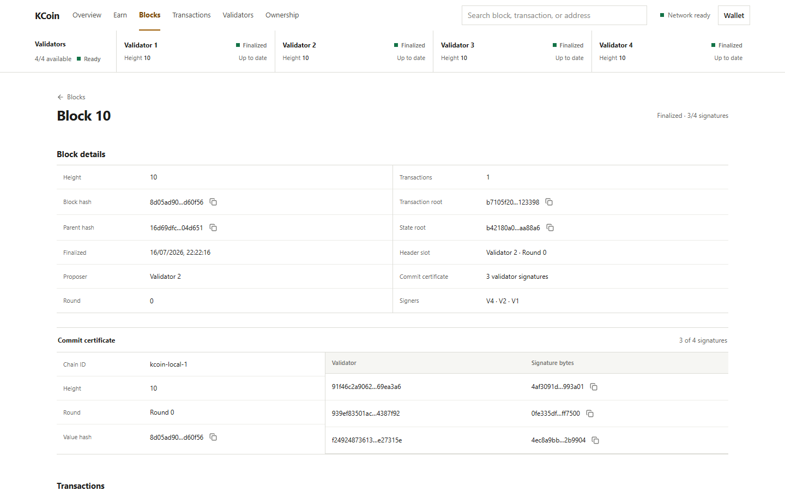
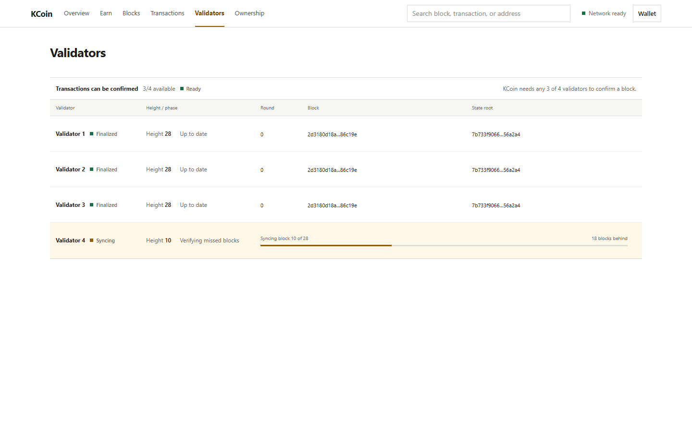

# Multi-Node Blockchain - KCoin

A four-validator blockchain and live explorer built in Rust and React, with browser-signed transactions, 3-of-4 finality, independent persistent ledgers, and verified recovery after node downtime.

**Stack:** Rust · React · Axum · rust-libp2p/QUIC · SQLite · WebCrypto · Docker Compose

[](docs/assets/kcoin-demo.webm)

The real-network demo follows one continuous workflow:

1. Create a browser wallet and save its backup.
2. Solve an arithmetic challenge to earn KCoin.
3. Send KCoin to another address.
4. Open the finalized transaction, block, and commit certificate.
5. Stop Validator 4 while the other three continue finalizing.
6. Restart it and watch **Offline → Syncing → Up to date**.

Watch the [full 1:53 live recording](docs/assets/kcoin-demo.webm). The capture uses four validator containers, one observer, five independent SQLite databases, and the real browser wallet—no mocked chain data.

> KCoin is an experimental portfolio network with no real monetary value. It is not a production cryptocurrency or wallet.

## What I built

- **Protocol and ledger:** Ed25519-signed transactions, Bech32m addresses, canonical Borsh encoding, domain-separated BLAKE3 hashes, nonce and expiry checks, deterministic execution, state roots, and commit certificates.
- **Challenge issuance:** A deterministic arithmetic challenge creates supply without a premine. Rewards decrease across issuance bands until the 100,000 KCoin cap.
- **Consensus:** A deterministic `Proposal → Prevote → Precommit → Finalize` state machine with rotating proposers, locks, valid-round proofs, and three-signature quorum certificates.
- **Networking and recovery:** libp2p gossip over QUIC, bounded finalized-block requests, non-voting catch-up, and certificate-backed verification for returning nodes.
- **Persistence:** Independent SQLite databases, atomic block finalization, crash-safe signing records, canonical-history verification, and rebuildable explorer indexes.
- **Product surface:** A memory-only WebCrypto wallet, Axum REST/SSE API, live block explorer, validator recovery view, and ownership visualization.

I implemented the protocol rules, consensus state machine, node runtime, storage and synchronization paths, API, wallet integration, explorer, tests, and Docker devnet. Established libraries provide the cryptographic primitives, canonical serialization, networking transport, and SQLite bindings.

## Run the network

Docker with Compose v2 is the only prerequisite.

```bash
docker compose up --build --detach --wait
```

Open [http://localhost:8080](http://localhost:8080). The observer API is available at `http://localhost:4100`.

This starts four validators, one non-voting observer/API node, the React app, and five independent SQLite volumes. To stop the network and delete its local chain data:

```bash
docker compose down --volumes
```

## How finality works



The browser generates an Ed25519 key and signs canonical transaction bytes locally; private key material never reaches a node. A rotating proposer places the transaction in a candidate block, and every validator independently checks its signature, nonce, balance, transaction root, and resulting state root.

Validators first prevote, then precommit. Three matching precommits from the fixed four-validator set form a commit certificate. That certified block is final immediately—there is no longest-chain fork choice or later reorganization.

[](docs/assets/demo-04-explorer-certificate.png)

The safety model assumes no more than one Byzantine validator. One unavailable validator leaves a three-node quorum; a 2-2 partition halts instead of allowing either side to finalize alone.

## Validator failure and recovery

```bash
docker compose stop validator-4
```

Earn or send KCoin while it is offline. Validators 1–3 still produce a three-signature certificate, so the explorer height advances. Then restart it:

```bash
docker compose start validator-4
```

The returning validator does not vote while behind. It requests finalized blocks and verifies every certificate, parent link, transaction, and state root before committing locally. Recovery is complete only when its height, finalized block hash, and state root match the network.

[](docs/assets/demo-07-validator-syncing.png)

See the [offline](docs/assets/demo-06-validator-offline.png) and [fully recovered](docs/assets/demo-08-validator-recovered.png) states.

## Tested evidence

| Property | Automated evidence |
| --- | --- |
| Forged, replayed, duplicate, expired, and overspent transactions are rejected without mutation | [Ledger tests](crates/kcoin-protocol/src/ledger.rs) |
| One equivocating validator cannot make honest validators finalize conflicting blocks | [Consensus simulations](crates/kcoin-consensus/src/simulation.rs) |
| Three validators continue finalizing while one is unavailable | [Simulations](crates/kcoin-consensus/src/simulation.rs) and [real libp2p integration](crates/kcoin-node/src/runtime.rs) |
| A late validator and observer verify missed history and converge on block hash and state root | [Runtime integration tests](crates/kcoin-node/src/runtime.rs) |
| Canonical history reconstructs ledger state and explorer projections | [Protocol replay](crates/kcoin-protocol/src/ledger.rs) and [storage tests](crates/kcoin-node/src/storage.rs) |
| Rust and frontend code agree on addresses, signing bytes, signatures, and transaction IDs | [Rust vectors](crates/kcoin-protocol/tests/golden_vectors.rs) and [frontend vectors](web/src/test/wallet-vectors.test.ts) |

The [threat and correctness matrix](docs/threat-model.md) links each claim to a test and marks partial evidence explicitly.

```bash
cargo test --locked --workspace --all-targets
cd web
npm ci
npm test
npm run build
```

GitHub Actions also builds the complete Docker network, finalizes real transactions, proves progress with Validator 4 offline, restarts it, and compares the recovered height, block hash, and state root.

## Repository guide

| Path | Contents |
| --- | --- |
| [`crates/kcoin-protocol`](crates/kcoin-protocol/) | Transactions, cryptography, ledger execution, blocks, roots, and certificates |
| [`crates/kcoin-consensus`](crates/kcoin-consensus/) | Consensus state machine, quorum logic, locking, timers, and simulations |
| [`crates/kcoin-node`](crates/kcoin-node/) | Networking, persistence, synchronization, API, health, and metrics |
| [`crates/kcoin-cli`](crates/kcoin-cli/) | Verification, reindexing, wallet utilities, and latency smoke tooling |
| [`web`](web/) | Browser wallet, explorer, ownership view, and validator UI |

Start with the zero-prerequisite [blockchain guide (PDF)](docs/multi-node-blockchain-from-zero.pdf), then read the [architecture](docs/architecture.md), [protocol](docs/protocol.md), [persistence](docs/persistence.md), [synchronization](docs/synchronization.md), [benchmark methodology](docs/benchmarks.md), and [demo method](docs/demo.md).

## Scope

KCoin deliberately excludes smart contracts, mining, staking, fees, dynamic validator membership, slashing, governance, public peer discovery, snapshot sync, production custody, and public-cloud hardening.

The included benchmark command is a sequential latency smoke harness, not a network-capacity benchmark. No throughput claim is published without reproducible saturation testing and committed raw results.

## License

Licensed under the [MIT License](LICENSE).
