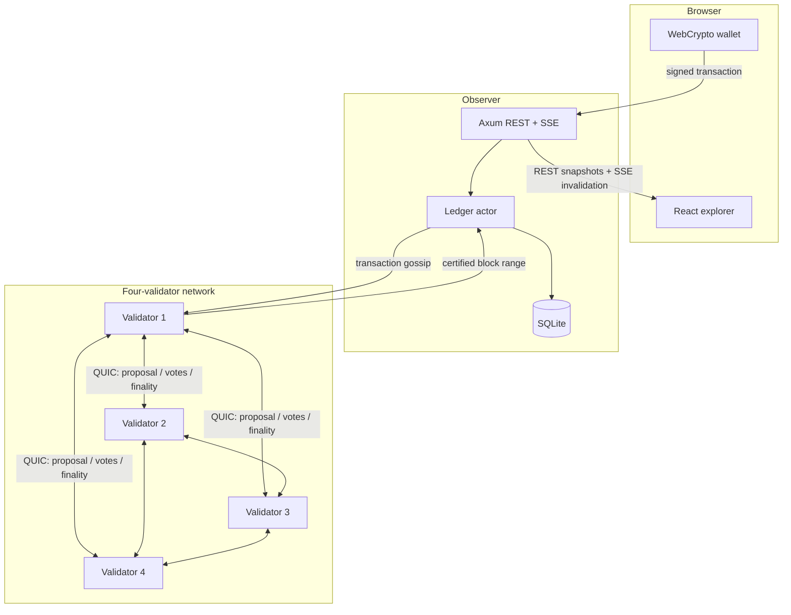
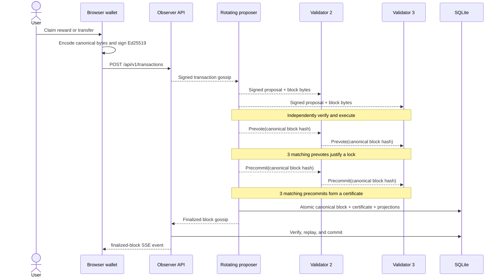

# Architecture

KCoin separates deterministic decisions from unreliable I/O. The protocol and consensus crates decide what is valid; the node arranges networking, timers, persistence, and HTTP around those pure rules.

## Component boundaries

| Component | Responsibility | Must not decide |
| --- | --- | --- |
| [`kcoin-protocol`](../crates/kcoin-protocol/src/lib.rs) | Canonical types, signatures, addresses, transaction execution, challenges, blocks, roots, certificates | Network order, database policy, API shape |
| [`kcoin-consensus`](../crates/kcoin-consensus/src/lib.rs) | Proposal, prevote, precommit, locks, valid-round proofs, quorum certificates | Wallet balances, transaction validity, storage format |
| [`kcoin-node`](../crates/kcoin-node/src/lib.rs) | Ledger actor, mempool, libp2p, timers, SQLite, sync, REST/SSE | Alternate ledger or quorum rules |
| Observer role | Verified finalized-block sync and public read/write API without a validator key | Consensus votes |
| [`web`](../web/src/App.tsx) | Memory-only key custody, canonical signing adapter, explorer, ownership visualization | Whether a transaction or block is valid |

Every validator given the same finalized history reconstructs the same balances, nonces, issued supply, active challenge, transaction index, and state root.

## Transaction and finality flow

At each height, proposer selection rotates by height and round. If a proposal is missing or invalid, validators time out into a later round. A lock prevents an honest validator from switching values unless a newer proof-of-lock certificate justifies that switch. A final certificate requires three of the four fixed validator keys.

## One block ID, separate round proof

KCoin keeps canonical history independent of which valid round certificate a node observes first:

| Object | Round metadata | Used for |
| --- | --- | --- |
| **Canonical block** (`Block::hash`, also returned by `consensus_hash`) | Declared proposer slot and construction round are inside the immutable header | Proposal ID, votes, locks, SQLite/explorer identity, parent links, status comparison, and conflict detection |
| **Signed proposal envelope** | Current rotating proposer and current round | Authenticates the validator carrying those exact block bytes in this round |
| **Commit certificate** | Finality round | Proves a quorum precommitted the canonical block ID in that round |

A locked value carried into a later round is re-proposed byte-for-byte. Its declared header slot remains unchanged; the new signed envelope authenticates the later-round carrier and the final certificate proves the finality round. Header metadata is not separately authenticated provenance of the first proposal envelope. Two different valid certificates can therefore prove the same canonical block, but they cannot produce different explorer IDs or parent links. The regression tests are in [`commit.rs`](../crates/kcoin-protocol/src/commit.rs) and [`runtime.rs`](../crates/kcoin-node/src/runtime.rs).

Certificates are stored separately from blocks, avoiding a circular dependency between block identity and the signatures over that identity.

## Recovery paths

KCoin has two independent recovery paths:

1. **Finalized-history catch-up.** A lagging node becomes non-voting, requests bounded certified ranges, and verifies the chain-bound certificate, immutable header metadata, parent link, transactions root, transaction execution, and state root before each commit. See [Synchronization](synchronization.md).
2. **Interrupted-round restore.** Before broadcasting a local proposal or vote, a validator atomically stores the exact signing bytes, signature, signed message, and resulting safety state. That state includes the lock plus the authenticated prevote quorum that proves its latest valid value. On restart it reconstructs the finalized ledger, validates the active safety record and persisted proposals, restores locks, valid-round proof, and used signer slots, replays those messages into the state machine, and rebroadcasts the already-signed messages. Inconsistent or incomplete safety state fails startup closed. See [Persistence](persistence.md).

When a finalized block commits, clearing the now-obsolete in-progress safety state occurs in the same SQLite transaction as the block. A restart therefore cannot observe the new finalized tip alongside the prior height's active lock.

There is no longest-chain fork choice. Receiving a different certified canonical block at an already finalized height halts the node instead of reorganizing history.

## Decision records

- [ADR 0001: Tendermint-inspired four-validator consensus](adr/0001-consensus.md)
- [ADR 0002: Canonical Rust protocol core](adr/0002-protocol.md)
- [ADR 0003: Canonical blocks with rebuildable SQLite projections](adr/0003-persistence-and-replay.md)
- [ADR 0004: libp2p gossip plus verified range synchronization](adr/0004-networking-and-recovery.md)
- [ADR 0005: Memory-only browser wallet inside the explorer](adr/0005-browser-wallet-and-explorer.md)
